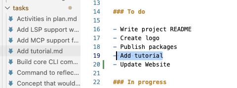
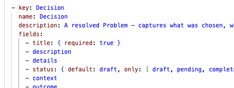
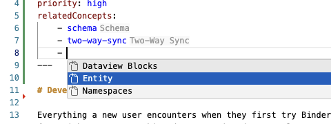
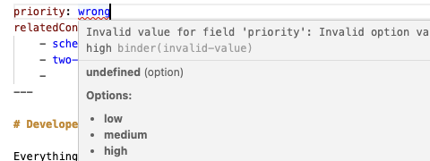

<div align="center">

# Binder
### A Markdown-native knowledge graph for you and your agents

Combine the flexibility of plain text with the capabilities of a structured database in a local-first knowledge base with bidirectional Markdown sync, editor integration, and rich API.

[](https://opensource.org/licenses/MIT)
[](https://bun.sh)
[](https://www.typescriptlang.org/)
[]()

[Features](#key-features) • [How you interact](#how-you-interact-with-binder) • [Installation](#installation) • [Usage](#usage)

</div>

---

> [!WARNING]  
> **This project is currently in early development.**  
> Internal data structures, configuration formats, and APIs are subject to breaking changes.  
> **Data loss is possible.** Do not use for critical data without independent backups.

##  Features

<table>
  <tr>
    <td align="center">
      <br/>
      <sub><b>Bidirectional sync</b> — your edits are automatically captured and reflected in the knowledge graph. Change anything, anywhere, and Binder keeps up.</sub>
    </td>
    <td align="center">
      <br/>
      <sub><b>Data models</b> — define your types and fields in a simple YAML schema. Easy to write, easy to evolve.</sub>
    </td>
  </tr>
  <tr>
    <td align="center">
      <br/>
      <sub><b>Autocomplete</b> — Binder knows your schema, so your editor does too. Links, field names, and valid values complete as you type.</sub>
    </td>
    <td align="center">
      <br/>
      <sub><b>Editor integration</b> — data validation, go to definition, and info on hover. Everything you need, right in your editor.</sub>
    </td>
  </tr>
</table>

- **Bidirectional Markdown sync**: Markdown files are a first-class view of the graph. Edit in any editor or update via the CLI or API and Binder keeps both consistent.
- **Transaction log**: Every change is recorded as an append-only entry in `.binder/transactions.jsonl`, so state can be rebuilt, audited, and replayed reliably.
- **Template system**: Render structured data into Markdown using templates and extract updated field values back from the edited document, enabling reliable round-trip editing.
- **Editor integration**: Binder runs as a language server that provides link completion, schema validation, diagnostics, and hover previews while you edit.
- **Local-first and private**: Your data stays on your machine, and syncing or backups can be simple because the log is the source of truth.

## How you interact with Binder

Binder separates data from representation, allowing humans, agents, and automation to collaborate on the same knowledge graph.

- **Editors**: Use plain Markdown in VS Code, Vim, or Obsidian, with Binder providing inline intelligence and validation as you type.
- **AI agents**: Agents can read Markdown for broad context, then use MCP to query the structured graph and to apply updates programmatically.
- **Automation**: Use the CLI and API to import data, run batch updates, generate reports, and build pipelines that read and rewrite your workspace safely.

## Getting Started

### Prerequisites

- [Bun](https://bun.sh/) (v1.2+ recommended)

### Installation

1. Clone the repository:
   ```bash
   git clone <repo-url>
   cd binder
   ```

2. Install dependencies:
   ```bash
   bun install
   ```

### Usage

Binder is a monorepo containing the core database logic, CLI, and integrations.

To run the development CLI:
```bash
bun run dev
```

To build the CLI for production:
```bash
bun run build
```

To inspect the Model Context Protocol (MCP) server:
```bash
bun run mcp:inspect
```

## Configuration

Binder manages your knowledge graph configuration in the `.binder/` directory:

- `templates/`: Define markdown templates for rendering and extraction.
- `types.yaml`: Define entity types (e.g., Task, Person, Project).
- `fields.yaml`: Define reusable fields and their validation rules.
- `config.yaml`: General workspace settings.
